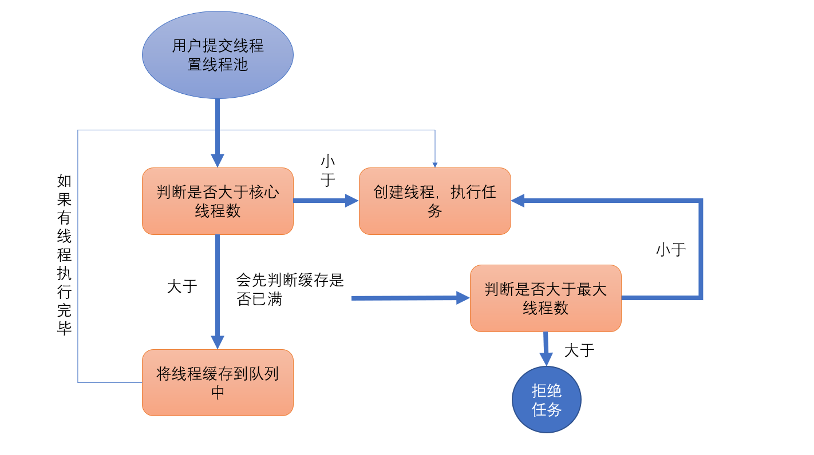

# 前言：

#### 需要掌握的知识点：

- 并发队列：ConcurrentLinkedQueue（非阻塞）、BlockingQueue（阻塞）【核心】
- 线程池原理
- 自定义线程池

#### 改进笔记：

- 不是过于基础的代码尽量置于笔记中，之前的也会抽空整理
- 发现使用引用还是有些混乱，正在想办法解决


# 一、并发包

### 1.1 计数器（CountDownLatch）

&emsp;&emsp;位于`java.util.concurrent`，可以实现类似计数器的功能，**计数器可以设置一个初始值，每当一个线程完成任务计数器减一，直到为0闭锁等待的线程就会恢复执行**。

&emsp;&emsp;**使用场景**：一个任务需要等待其他四个任务执行完毕后才能执行。


**使用CountDownLatch：**

```java
public class TestCountDownLatch {
    public static void main(String[] args) {
        final CountDownLatch countDownLatch = new CountDownLatch(10);

        new Thread(() -> {
            System.out.println("测试归0运行线程。。。。。。。。。");
            try {
                //等待计数器归零
                countDownLatch.await();
            } catch (InterruptedException e) {
                e.printStackTrace();
            }
            System.out.println("测试归0运行线程结束。。。。。。。。。");
        }).start();

        for (int i = 0; i < 10; i++) {
            //循环运行10次
            new Thread(() -> {
                System.out.println("运行后减一线程运行。。。。。。。。。");
                //计数器减一
                countDownLatch.countDown();
                System.out.println("运行后减一线程结束。。。。。。。。。");
            }).start();
        }

        System.out.println("main结束。。。。。");
    }
}
```


### 1.2 屏障（CyclicBarrier）

&emsp;&emsp;`CyclicBarrier`初始化时规定一个数目，和一个线程【可为空】，等待调用`await()`方法的线程数达到此属木。就会执行初始化时传入的线程，然后唤醒其他。

```java
/**
 * 测试使用并发包屏障
 */
public class TestCyclicBarrier {
    public static void main(String[] args) {
        //等到这10个工人干完活，老板过来发钱
        CyclicBarrier cyclicBarrier = new CyclicBarrier(10, new Boss());
        WorkingTogether together = new WorkingTogether(cyclicBarrier);
        //循环创建10个工人干活
        for (int i = 0; i < 10; i++) {
            new Thread(together).start();
        }
    }
}

/**
 * 凑齐了一起干后
 */
class WorkingTogether implements Runnable {
    private CyclicBarrier cyclicBarrier;
    //构造
    public WorkingTogether(CyclicBarrier cyclicBarrier) {
        this.cyclicBarrier = cyclicBarrier;
    }
    @Override
    public void run() {
        System.out.println("开始干活");
        try {
            Thread.sleep(3000);
        } catch (InterruptedException e) {
            e.printStackTrace();
        }
        System.out.println("活干的差不多了");
        System.out.println("一边干一边等老板过来发钱");
        try {
            //等人们活都干的差不多了，老板就来
            cyclicBarrier.await();
        } catch (Exception e) {

        }
        System.out.println("收拾东西回家");
    }
}

/**
 * 活快干完了，给大家发钱，干完活就回家吧
 */
class Boss implements Runnable {
    @Override
    public void run() {
        System.out.println("给大家发钱，干完活就回家吧，明年再来了");
    }
}
```


### 1.3 技术信号量（Semaphore）

&emsp;&emsp;`Semaphore`是一种基于技术的信号量，它可以设置一个阈值。多个线程竞争许可信号，如果当前已经超过阈值则线程等待。也可以设置阈值为`1`，将其用作类似互斥锁，也叫二元信号量。

| 方法               | 说明                   |
| ------------------ | ---------------------- |
| `availablePermits` | 获取当前可用的资源数量 |
| `acquire`          | 申请资源               |
| `release`          | 释放资源               |

```java
public class TestSemaphore {
    public static void main(String[] args) {
        Semaphore semaphore = new Semaphore(3);

        for (int i = 0; i < 10; i++) {
            new Thread(new ToiletUsers("第" + i + "个人", semaphore)).start();
        }
    }
}

@Data
@AllArgsConstructor
class ToiletUsers implements Runnable {
    //人名字
    private String name;
    //计数信号量对象
    private Semaphore wc;
    @Override
    public void run() {
        //剩下的资源
        int ap = wc.availablePermits();
        if (ap > 0) {
            System.out.println(name + "：天助我也，有空的厕所。。。");
        } else {
            System.out.println(name + "：我的天哪一个空的都没有。。。");
        }

        try {
            //申请资源
            wc.acquire();
        } catch (Exception e) {

        }
        System.out.println(name + ",蹲下拿出手机，爽。。，剩下厕所：" + wc.availablePermits());

        try {
            //上厕所所用时间
            Thread.sleep(new Random().nextInt(1000));
        } catch (InterruptedException e) {
            e.printStackTrace();
        }
        System.out.println(name + "：终于上完厕所了");
        //释放资源
        wc.release();
    }
}
```


### 1.4 并发队列


#### 1.4.1 阻塞式队列和非阻塞式队列

1. `ArrayDeque`（数组双端队列）
2. `PriorityQueue`（优先级队列） 
3. `ConcurrentLinkedQueue`（基于链表的并发队列） 
4. `DelayQueue`（延期阻塞队列）（阻塞队列实现了BlockingQueue接口） 
5. `ArrayBlockingQueue`（基于数组的并发阻塞队列） 
6. `LinkedBlockingQueue`（基于链表的FIFO阻塞队列） 
7. `LinkedBlockingDeque`（基于链表的FIFO双端阻塞队列） 
8. `PriorityBlockingQueue`（带优先级的无界阻塞队列） 
9. `SynchronousQueue` （并发同步阻塞队列）

##### 1.4.1.1 区别

| 区别 | 阻塞式队列                                         | 非阻塞队列 |
| ---- | -------------------------------------------------- | ---------- |
| 入列 | 超出队列总数时，进行等待，直至有队列元素被消费     | 超出报错   |
| 出列 | 获取队列为空时，进行等待，直至新的元素被添加进队列 | 直接报空   |

> **阻塞式队列更好一些，非阻塞性能更好，但是不安全**
>
> ​		消费者和容器的承载是有限度的，如果生产者不停的存放就会出错。这就是非阻塞的问题。这是就会造成数据丢失等问题。


#### 1.4.2 非阻塞式队列

&emsp;&emsp;`ConcurrentLinkedDeque`：适用于高并发场景下的队列，通过无锁实现，是一个**基于链接节点【链表】的无界线程安全队列**。不允许空元素。


##### 1.4.2.1 方法描述

| 方法名    | 返回值    | 描述                                                       |
| --------- | --------- | ---------------------------------------------------------- |
| `add()`   | `boolean` | 加入元素，与`offer`没有任何区别【ConcurrentLinkedDeque中】 |
| `offer()` | `boolean` | 加入元素，与`add`没有任何区别【ConcurrentLinkedDeque中】   |
| `poll()`  | `E`       | 取出头元素后删除                                           |
| `peek()`  | `E`       | 取出头元素不会删除                                         |


##### 1.4.2.2 代码演示

```java
/**
 * 非阻塞式队列
 */
public class TestConcurrentLinkedQueue {
    public static void main(String[] args) {
        //非阻塞队列【无界】：并发包中
        ConcurrentLinkedQueue<String> concurrentLinkedQueue = new ConcurrentLinkedQueue<>();
        //添加队列
        concurrentLinkedQueue.offer("张三");
        concurrentLinkedQueue.offer("李四");
        concurrentLinkedQueue.offer("王五");
        //获取队列 只能获取一个队列元素
        System.out.println(concurrentLinkedQueue.poll());
        //获取队列个数
        System.out.println(concurrentLinkedQueue.size());
        //取出不删除
        System.out.println(concurrentLinkedQueue.peek());
        //获取队列个数
        System.out.println(concurrentLinkedQueue.size());
        //取出到没有，再取一个
        System.out.println(concurrentLinkedQueue.poll());
        System.out.println(concurrentLinkedQueue.poll());
        System.out.println(concurrentLinkedQueue.poll());
    }
}
```


#### 1.4.3  阻塞队列

&emsp;&emsp;`BlockingQueue`阻塞队列接口，其子类提供了两种队列：`FIFO`（先进先出）和`LIFO`（后进先出）


##### 1.4.3.1 ArrayBlockingQueue队列

&emsp;&emsp;是一个有边界的阻塞队列【先进先出】，内部实现是一个数组，在初始化时必须指定他的容量。


###### 1. 方法：

| 方法                                      | 返回值    | 描述                                     |
| ----------------------------------------- | --------- | ---------------------------------------- |
| `offer(E e)`                              | `boolean` | 非阻塞添加                               |
| `offer(E e, long timeout, TimeUnit unit)` | `boolean` | 阻塞添加，队列如果满了，那么等待设置时间 |
| `poll()`                                  | `E`       | 非阻塞取                                 |
| `poll(long timeout, TimeUnit unit)`       | `E`       | 阻塞取                                   |


###### 2.演示：

```java
//阻塞时队列最大好处，能够防止队列容器溢出，防止丢失数据
public class TestBlockingQueue {
    @Test
    public void testArrayBlockingQueue() {
        //3：表最多支持元素总数
        ArrayBlockingQueue<String> blockingQueue = new ArrayBlockingQueue<>(3);
        //非阻塞添加
        blockingQueue.offer("张三");
        //阻塞添加，队列不满不需要等待
        try {
            blockingQueue.offer("李四", 3, TimeUnit.SECONDS);
        } catch (InterruptedException e) {
            e.printStackTrace();
        }
        blockingQueue.offer("王五");
        try {
            boolean b = blockingQueue.offer("赵六", 3, TimeUnit.SECONDS);
            System.out.println(b ? "添加成功" : "添加失败");
        } catch (InterruptedException e) {
            e.printStackTrace();
        }

        //取队列
        System.out.println(blockingQueue.poll());
        System.out.println(blockingQueue.poll());

        try {//此时会取不到，我们设置了等待时间。所以等待3秒。不成功为null
            System.out.println(blockingQueue.poll(3,TimeUnit.SECONDS));
        } catch (InterruptedException e) {
            e.printStackTrace();
        }

        try {//此时会取不到，我们设置了等待时间。所以等待3秒。不成功为null
            System.out.println(blockingQueue.poll(3,TimeUnit.SECONDS));
        } catch (InterruptedException e) {
            e.printStackTrace();
        }
    }
}
```


##### 1.4.3.2 LinkedBlockingQueue队列

&emsp;&emsp;是一个链表实现的队列【尾插，先进先出】，其可以设置边界，也可以不设置边界，不设边界有一个默认值【伪无界】


##### 1.4.3.3 LinkedBlockingQueue队列

&emsp;&emsp;没有边界的有序队列，也就是说他是会排序的，排序规则同`java.util.PriorityQueue`，放入其中的对象必须实现比较器`Comparable`接口，该队列也可以获取迭代器`Iterator`。


##### 1.4.3.3 SynchronousQueue队列

&emsp;&emsp;内部仅允许容纳一个元素。当一个线程插入一个元素后会被阻塞，除非这个元素被另一个线程消费。&emsp;


#### 1.4.4 使用BlockingQueue实现生产者与消费者

```java
/**
 * 生产者
 */
class Producers implements Runnable{
    //用与存放生产的信息
    private BlockingQueue<String> queue;
    //保证了多线程生产时不会重复，原子加减
    private static AtomicInteger count = new AtomicInteger();
    //线程运行的标记，默认为true
    private volatile boolean FLAG = true;

    /**
     * 构造方法传入队列一共生产
     */
    public Producers(BlockingQueue<String> queue) {
        this.queue = queue;
    }

    @Override
    public void run() {
        System.out.println(Thread.currentThread().getName() + "当前生产者线程开始运行");
        //如果标记为true，我们进行生产工作
        while (FLAG){
            String data = count.incrementAndGet() + "";
            //开始阻塞生产
            try {
                boolean offer = queue.offer(data, 2, TimeUnit.SECONDS);
                if (offer) {
                    //生产成功
                    System.out.println(Thread.currentThread().getName() + "生产" + data + "成功");
                }else{
                    //生产失败
                    System.out.println(Thread.currentThread().getName() + "生产" + data + "失败");

                }
                Thread.sleep(1000);//休眠1秒
            } catch (Exception e) {

            }
        }
        System.out.println(Thread.currentThread().getName() + "当前生产者线程结束");
    }

    public void stop() {
        FLAG = false;
    }
}
/**
 * 消费者
 */
class Consumer implements Runnable {

    //用与存放消费的信息
    private BlockingQueue<String> queue;
    //线程运行的标记，默认为true
    private volatile boolean FLAG = true;

    /**
     * 构造方法需要提供队列
     * @param queue
     */
    public Consumer(BlockingQueue<String> queue) {
        this.queue = queue;
    }

    @Override
    public void run() {
        System.out.println(Thread.currentThread().getName() + "消费者开始执行");
        //通过标记判断是否还需要运行
        while (FLAG) {
            //阻塞取出队列
            try {
                String poll = queue.poll(2, TimeUnit.SECONDS);
                if (poll != null && !poll.isEmpty()) {
                    //取出数据来了
                    System.out.println("消费者消费成功，消费数据:" + poll);
                }else {
                    //停止线程
                    FLAG = false;
                    System.out.println("消费者等待了2秒还是没有数据");
                    return;
                }
            } catch (InterruptedException e) {

            }
        }
    }
}

public class ProAndCon {
    public static void main(String[] args) {
        //创建队列
        BlockingQueue<String> queue = new LinkedBlockingQueue<>(3);
        //创建生产者，并且开始生产
        Producers producers = new Producers(queue);
        new Thread(producers,"生产者1").start();
        new Thread(producers,"生产者2").start();
        //创建消费者开始消费
        new Thread(new Consumer(queue)).start();
        //休眠一段时间后停止生产者
        try {
            //休眠两分钟
            Thread.sleep(1000 * 60 * 2);
        } catch (InterruptedException e) {
            e.printStackTrace();
        }
        //停止生产
        producers.stop();
    }
}
```


# 二、线程池

&emsp;&emsp;Java中的线程池是运用场景最多的并发框架，几乎所有需要异步或并发执行任务的程序都可以使用线程池。

### 2.1 线程池的好处

1. **降低资源消耗**：通过复用，降低线程创建和销毁线程造成的消耗。【创建很消耗资源】
2. **提高相应速度**：不需要频繁创建、调度了，任务来了直接执行，所以自然速度有所提高。
3. **方便管理**：无限创建线程、不会出现什么问题。多了会缓存【阻塞队列】，还可以进行统一分配、调优和监控。

> 什么是线程池溢出：频繁的创建多线程，非常占用CPU、内存。【创建过多就会抛出线程池过多异常】

### 2.2 线程池的作用

&emsp;&emsp;线程池是为突然大量爆发的线程设计的，通过有限的几个固定线程为大量的操作服务，减少了创建和销毁线程所需的时间，从而提高效率。

&emsp;&emsp;如果一个线程的时间非常长，就没必要用线程池了(不是不能作长时间操作，而是不宜。)，况且我们还不能控制线程池中线程的开始、挂起、和中止。


### 2.3 线程池的分类

&emsp;线程池其实都是通过`Executor`框架的顶层实现类`ThreadPoolExecutor`去实现的，`Executors`工厂类中提供的`newScheduledThreadPool`、`newFixedThreadPool`、`newCachedThreadPool`方法其实也只是`ThreadPoolExecutor`的构造函数**参数不同而已**。


### 2.4 线程池的创建

通过`Executors`创建：

- 创建一个可缓存线程池：`newCachedThreadPool`
  - 当任务到达时，可灵活回收空闲线程，若无可回收，则新建线程。
- 创建一个定长的线程池：`newFixedThreadPool `
  - 可控制线程最大并发数，超出的线程会在队列中等待。
- 创建一个定长的线程池：`newScheduledThreadPool `
  - 支持定时及周期性任务执行。
- 创建一个单线程化的线程池：`newSingleThreadExecutor `
  - 只会用唯一的工作线程来执行任务，保证所有任务按照指定顺序(FIFO,LIFO, 优先级)执行


**代码演示**：

```java
public class TestThreadPool {
    /**
     * 创建可缓存的线程池
     */
    @Test
    public void testCachedThreadPool() {
        //创建可缓存的线程池（无限大小）
        ExecutorService threadPool = Executors.newCachedThreadPool();

        for (int i = 0; i < 100; i++) {
            final int temp = i + 1;
            //像线程池中添加将要执行的线程
            threadPool.execute(()->{
                //此时通过输出，我们可以发现线程被复用了
                System.out.println(Thread.currentThread().getName() + "," + temp);
            });
        }
    }

    /**
     * 固定长度的线程池
     * 该线程池通过队列进行缓存。
     */
    @Test
    public void FixedThreadPool() {
        //创建可固定长度线程池
        ExecutorService threadPool = Executors.newFixedThreadPool(3);

        for (int i = 0; i < 10; i++) {
            final int temp = i + 1;
            //像线程池中添加将要执行的线程
            threadPool.execute(()->{
                //此时通过输出，我们可以发现只有三个线程
                System.out.println(Thread.currentThread().getName() + "," + temp);
            });
        }
    }

    /**
     * 创建定时及周期性任务执行,由于等待的原因需要使用main去运行
     */
    public static void testScheduledThreadPool() {
        //创建一个定长且可以定时和周期任务的线程池
        ScheduledExecutorService threadPool = Executors.newScheduledThreadPool(3);

        for (int i = 0; i < 10; i++) {
            final int temp = i + 1;
            //像线程池中添加将要执行的线程,并且3秒之后在进行调度
            threadPool.schedule(()->{
                //此时通过输出，我们可以发现只有三个线程
                System.out.println(Thread.currentThread().getName() + "," + temp);
            },3 * i, TimeUnit.SECONDS);
        }
    }

    /**
     * 用来测试定时的那个
     * @param args
     */
    public static void main(String[] args) {
        testScheduledThreadPool();
    }

    /**
     * 创建单线程的线程池
     */
    @Test
    public void testSingleThreadExecutor() {
        //创建单线程的线程池
        ExecutorService threadPool = Executors.newSingleThreadExecutor();
        for (int i = 0; i < 10; i++) {
            final int temp = i + 1;
            //像线程池中添加将要执行的线程
            threadPool.execute(()->{
                //此时通过输出，我们可以发现只有三个线程
                System.out.println(Thread.currentThread().getName() + "," + temp);

            });
        }
        //关闭线程池
        threadPool.shutdown();
    }
}
```


### 2.5 线程池原理分析

#### 2.5.1 ThreadPoolExecutor构造函数

**1. 参数分析**：

| 参数                                | 描述                                                   |
| ----------------------------------- | ------------------------------------------------------ |
| `int corePoolSize`                  | 核心线程数，始终保持运行，不特殊设置空闲也会保留       |
| `int maximumPoolSize`               | 最大线程数，线程池最多创建多少线程                     |
| `long keepAliveTime`                | 如果某线程空闲了该市场，那么就销毁，直至只剩下核心线程 |
| `TimeUnit unit`                     | 上个参数的时间单位                                     |
| `BlockingQueue<Runnable> workQueue` | 线程的缓存，等待的线程就放在这个阻塞队列中             |

**2. 原理图**




#### 2.5.2 自定义线程池

&emsp;&emsp;为了能更明了的说明整个过程，我们简单的用代码实现一下。

```java
/**
 * 自定义线程池
 */
public class MyThreadPool {
    public static void main(String[] args) {
        //核心线程数1，最大线程数2
        ThreadPoolExecutor threadPool = new ThreadPoolExecutor(1, 2,
                30L, TimeUnit.MICROSECONDS,
                new LinkedBlockingQueue<Runnable>(3));

        //任务 1 现在创建线程在执行
        threadPool.execute(new TaskThread("任务1"));
        //任务2 存在在队列
        threadPool.execute(new TaskThread("任务2"));
        //任务3 存在在队列
        threadPool.execute(new TaskThread("任务3"));
        //任务4 存在在队列
        threadPool.execute(new TaskThread("任务4"));
        //任务5 创建执行，因为没有到最大线程数
        threadPool.execute(new TaskThread("任务5"));
        //任务6，抛出异常 被拒绝了，队列满了，也到最大线程数了.
        threadPool.execute(new TaskThread("任务6"));
    }
}

class TaskThread implements Runnable {
    private String threadname;
    public TaskThread(String threadName) {
        this.threadname = threadName;
    }

    @Override
    public void run() {
        System.out.println(Thread.currentThread().getName() + ":" + threadname);
        try {
            Thread.sleep(1000 * 5);
        } catch (InterruptedException e) {
            e.printStackTrace();
        }
    }
}
```


### 2.6 配置合理的线程数

&emsp;&emsp;原则：**CPU密集型**时不需要太多线程，避免频繁的切换【**cpu线程数**】，**IO密集型**配置尽量多的线程数【**2 * cpu线程数**】


**CPU密集**：该任务需要大量的运算，而没有阻塞情况。cpu全速运行

**IO密集**：该任务需要大量的IO操作，大量的阻塞。


**最佳线程数目** = `（（线程等待时间+线程CPU时间）/线程CPU时间 ）* CPU数目`