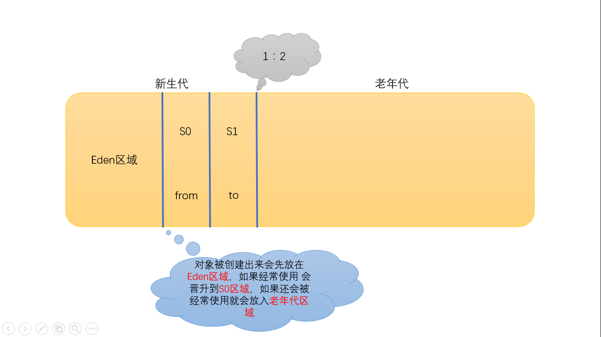

# 前言：

#### 需要掌握的点：

- JVM java内存结构
- 垃圾回收机制算法
- Jvm中如何判断对乡村会
- GC日志
- 基本参数调优
- 基本性能检测工具
- 垃圾回收机制 串行回收和并行回收 垃圾收集
- 类加载器（ClassLoder）

> 感觉架构的视频就像书对培训班知识的补充，有一个人带着理解确实方便很多。但是看书还是有必要的，看过视频后看书，会比直接看书轻松很多。

# 一、什么是JVM？

### 1.1 HotSpot VM

&emsp;&emsp;`HotSpot VM`是`Sun JDK`和`OpenJDK`中所带的虚拟机，也是目前使用范围最广的**Java虚拟机**。看起来“血统纯正”的虚拟机在最初并非由`Sun`公司开发，而是由一家名为`“Longview Technologies”`的小公司设计的。

&emsp;&emsp;甚至这个虚拟机最初并非是为Java语言而开发的，它来源于`Strongtalk VM`，这款虚拟机中相当多的技术又是来源于一款支持Self语言实现“达到C语言50%以上的执行效率”的目标而设计的虚拟机。

&emsp;&emsp;Sun公司注意到了这款虚拟机在JIT编译上有许多优秀的理念和实际效果，在1997年收购了Longview Technologies公司，从而获得了HotSpot VM。

&emsp;&emsp;`HotSpot VM`既继承了`Sun`**之前两款商用虚拟机的优点**（如前面提到的准确式内存管理），也有许多自己新的技术优势，

如它名称中的`HotSpot`指的就是它的**热点代码探测技术**（其实两个`VM`基本上是同时期的独立产品，`HotSpot`还稍早一些，`HotSpot`一开始就是准确式`GC`，而`Exact VM`之中也有与HotSpot几乎一样的**热点探测**。

&emsp;&emsp;在2008年和2009年，Oracle公司分别收购了BEA公司和Sun公司，这样Oracle就同时拥有了两款优秀的Java虚拟机：JRockit VM和HotSpot VM。Oracle公司宣布在不久的将来（大约应在发布JDK 8的时候）会完成这两款虚拟机的整合工作，使之优势互补。整合的方式大致上是在`HotSpot`**的基础上，移植**`JRockit`的优秀特性，譬如使用`JRockit`的垃圾回收器与`MissionControl`服务，**使用HotSpot的JIT编译器与混合的运行时系统。**&emsp;

> **热点探测：**如果一个方法被频繁调用，或方法中有效循环次数很多，将会分别触发标准编译和OSR（栈上替换）编译动作。

# 二、Java内存结构

### 2.1 Java堆（Java Heap）

&emsp;&emsp;java堆是java虚拟机所**管理的内存中最大的一块**，是被**所有线程共享的一块内存区域**，在虚拟机启动时创建。此内存区域的唯一目的就是存放对象实例，这一点在Java虚拟机规范中的描述是：**所有的对象实例以及数组都要在堆上分配。**

&emsp;&emsp;java堆是**垃圾收集器管理的主要区域**，因此也被成为`“GC堆”（Garbage Collected Heap）`。从内存回收角度来看java堆可分为：新生代和老生代（当然还有更细致的划分，在下一章会讲到）。**从内存分配的角度看，线程共享的Java堆中可能划分出多个线程私有的分配缓冲区（Thread Local Allocation Buffer，TLAB）**。无论怎么划分，都与存放内容无关，无论哪个区域，存储的都是对象实例，进一步的划分都是为了更好的回收内存，或者更快的分配内存。

&emsp;&emsp;根据Java虚拟机规范的规定，java堆可以处于物理上不连续的内存空间中。当前主流的虚拟机都是可扩展的（通过 -Xmx 和 -Xms 控制）。**如果堆中没有内存完成实例分配，并且堆也无法再扩展时，将会抛出OutOfMemoryError异常。**

### 2.2 Java虚拟机栈（Java Virtual Machine Stacks）

&emsp;&emsp;java虚拟机栈是**线程私有**的，它的**生命周期和线程相同**。**虚拟机栈描述的是Java方法执行的内存模型**：**每个方法在执行的同时都会创建一个栈帧（Stack Frame）用于存储局部变量表、操作数栈、动态链接、方法出口等信息**。

&emsp;&emsp;咱们常说的堆内存、栈内存中，**栈内存指的就是虚拟机栈**。**局部变量表**存放了编译期可知的各种基本数据类型（**8个基本数据类型）、对象引用（地址指针）、returnAddress类型。**

&emsp;&emsp;**局部变量表所需的内存空间在编译期间完成分配。在运行期间不会改变局部变量表的大小。**

&emsp;&emsp;这个区域规定了两种异常状态：如果**线程请求的栈深度大于虚拟机所允许的深度**，则抛出`StackOverflowError`异常；如果虚拟机栈可以动态扩展，在扩展是**无法申请到足够的内存**，就会抛出`OutOfMemoryError`异常。

### 2.3 本地方法栈（Native Method Stack）

&emsp;&emsp;本地方法栈与虚拟机栈所发挥作用非常相似，它们之间的区别不过是**虚拟机栈为虚拟机执行Java方法（也就是字节码）服务，而本地方法栈则为虚拟机使用到的native方法服务。本地方法栈也是抛出两个异常。**

### 2.4 方法区（Method Area）

&emsp;&emsp;方法区与`java`堆一样，是**各个线程共享的内存区域**，它用于**存储已被虚拟机加载的类信息、常量、静态变量、即时编译器编译后的代码等**数据。它有个别命叫`Non-Heap`（非堆）。当方法区**无法满足内存分配需求**时，抛出`OutOfMemoryError`异常。

### 2.5 直接内存（Direct Memory）

&emsp;&emsp;直接内存**不是虚拟机运行时数据区的一部分**，也不是java虚拟机规范中定义的内存区域。但这部分区域也呗频繁使用，而且也**可能导致`OutOfMemoryError`异常。**

&emsp;&emsp;在`JDK1.4`中**新加入的`NIO（New Input/Output）`类**，引入了一种基于**通道**`（Channel）`与**缓冲区**`（Buffer）`的`I/O`方式，**它可以使用`Native`函数库直接分配堆外内存**，然后通过一个**存储在java堆中的`DirectByteBuffer`对象作为这块内存的引用进行操作。**

### 2.6 运行时常量池（Runtime Constant Pool）

&emsp;&emsp;**运行时常量池是方法区的一部分**。Class文件中除了有类的版本、字段、方法、接口等描述信息外，还有一项信息是常量池，**用于存放编译期生成的各种字面量和符号引用**，这部分内容将在加载后进入方法区的运行时常量池中存放。

### 2.7 程序计数器（Program Counter Register）

&emsp;&emsp;程序计数器是一块较小的内存空间，它可以看作是当前线程所执行的字节码的行号指示器。

&emsp;&emsp;由于Java虚拟机的**多线程是通过线程轮流切换并分配处理器执行时间的方式来实现的**，一个处理器都只会执行一条线程中的指令。因此，**为了线程切换后能恢复到正确的执行位置，每条线程都有一个独立的程序计数器**，各个线程之间计数器互不影响，独立存储。称之为**“线程私有”的内存**。**程序计数器内存区域是虚拟机中唯一没有规定`OutOfMemoryError`情况的区域。**

### 2.8 执行引擎

&emsp;&emsp;虚拟机核心的组件就是执行引擎，它负责执行虚拟机的字节码，一般会先进行编译成机器码后执行。

# 三、垃圾回收机制算法分析

### 3.1 什么是垃圾回收机制

&emsp;&emsp;JVM自动不定时的**回收不可达【不可访问】的对象**。垃圾回收系统是Java的核心，也是不可少的，Java有一套自己进行垃圾清理的机制，开发人员无需手动清理。

&emsp;&emsp;不可达就是对象不再被引用。

### 3.2 finalize方法

&emsp;&emsp;垃圾回收机制之前会进行执行的方法，`gc`后并不一定会即时回收。

### 3.3 新生代和老年代

&emsp;&emsp;堆内存划分为新生代【又分为`EDEN`、`S0=S1`区(用于复制和交换)】和老年代，默认的**化为比例为1：2【新生代：老年代】**

&emsp;&emsp;**新生代：**用于存放刚出生不久的对象，不是经常使用的对象。【垃圾回收频繁】

&emsp;&emsp;**老年代：**用于存放比较活跃的对象，经常被引用。

> 大对象会直接进入老年代，长期存活的对象将进入老年代

### 3.4 引用计数法判断对象是否存活

&emsp;&emsp;相当于每个对象有一个年龄【默认为0】，如果小于或者等于15，存放在新生代。如果大于15就会存放在老年代。如果对象被引用的话，年龄就会加1，如果没有被继续使用回收年龄减1。GC线程不定时进行回收时，如果为0就回收。

&emsp;&emsp;存在循环以来的问题，已经被淘汰。

### 3.5 根搜索（GC Roots）

&emsp;&emsp;在根搜索机制中，可达对象需要和根节点有依赖关系。如果没有和`GC roots`有任何引用的情况下，就说是不可达对象。

&emsp;&emsp;**GC Roots对象包括以下几种【Java中】：**

- 虚拟机栈（栈帧中的局部变量区，也叫做局部变量表）中引用的对象。
- 方法区中的类静态属性引用的对象。
- 方法区中常量引用的对象。
- 本地方法栈中**JNI(Native方法)**引用的对象。

### 3.6 垃圾回收机制策略

#### 3.6.1 标记清除算法

1. **标记清除算法的两个阶段：**
   - **标记阶段**：找到所有可访问的对象，做个标记。
   - **清除阶段**：遍历堆，把未被标记的对象回收。
2. **标记清楚算法的优缺点：**
   - 优点：
     - 可以解决循环引用问题
     - 必要时才回收（内存不足时）
   - 缺点：
     - 回收时，应用需要挂起。也就是`stop hte world`
     - 效率不该，尤其是要扫描对象比较多是。
     - **会造成内存碎片化**。【明明有内存，但是不连续，申请占用内存大的对象可能无法做到】

#### 3.6.2 复制算法

&emsp;&emsp;一开始会将可用内存分成两块，`from`区和`to`区。每次只使用`from`区，开始`GC`操作时，这个时候会将存活的对象复制到`to`区，然后清理整个`from`区。【解决了碎片化问题，能够很快清理】

1. **优点与缺点**
   - 优点：能够解决碎片化问题，快速，清理干净。
   - 缺点：浪费了部分空间
2. **总结**：GC回收将可达对象复制到下一个区域，然后直接清除当前区域所有对象。

#### 3.6.3 标记压缩算法

&emsp;&emsp;标记清除和标记压缩是很相似的，标识压缩算法呢解决了碎片化的问题。会在做清理的时候整理内存。

1. **压缩算法简单介绍**
   - **任意顺序**：几部考虑原先对象排列顺序，也不考虑引用关系，随意移动对象。
   - **线性顺序**：考虑引用关系，如果a引用了b，就尽可能让两个对象移动到一块。
   - **滑动顺序**：按照对象原来在堆中的顺序滑动到堆的一端。

2. **优点和缺点**：
   - **优点**：解决内存碎片问题。
   - **缺点**：压缩阶段，由于移动了可用对象，需要去更新引用。

#### 3.6.4 分代算法

&emsp;&emsp;根据对象的生存周期将内存空间划分，针对于不同的空间使用不用的算法

1. **Minor GC和Full GC的区别**
   - **新生代 GC【Minor GC】**：指发生在新生代的垃圾收集动作，回收比较频繁，回收的速度也比较快。
   - **老年代 GC【Major GC/Full GC】**：指发生在老年代的GC，出现了Major GC，经常会伴随至少一次的Minor Gc【并非绝对】。速度一般会比新生代GC慢10倍以上。

> 注：`Full GC`会清理永久代【Java移除】，当永久代满了的时候，就会触发`Full GC`

