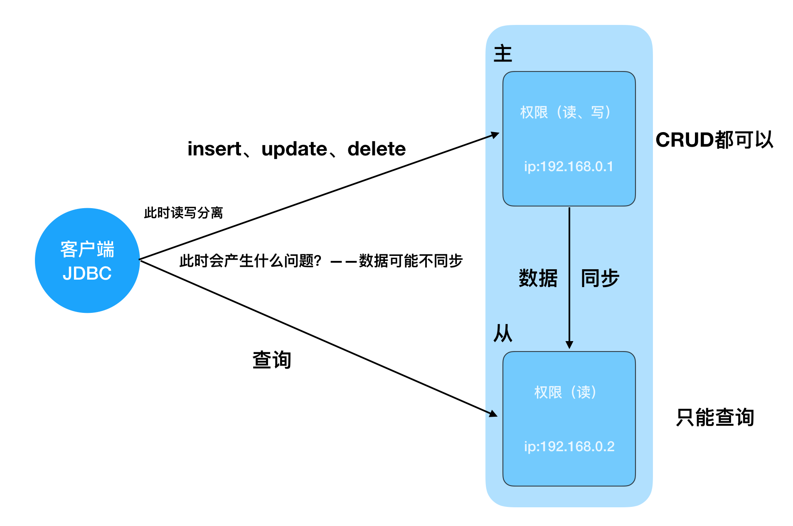
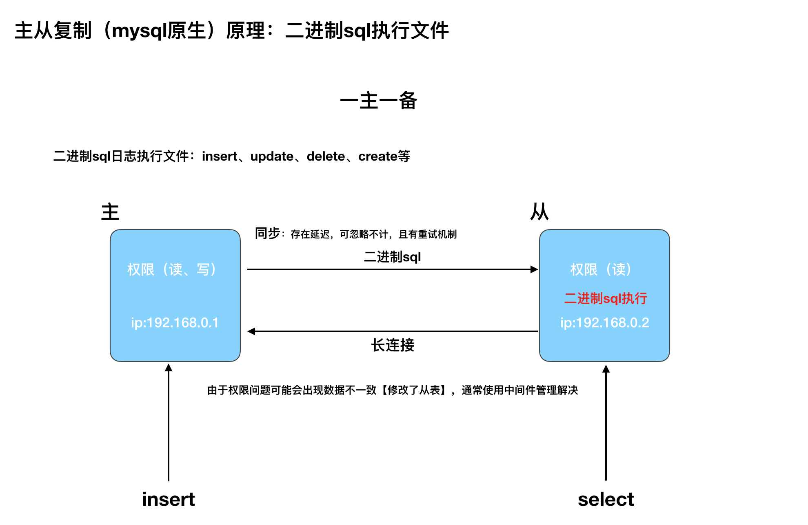
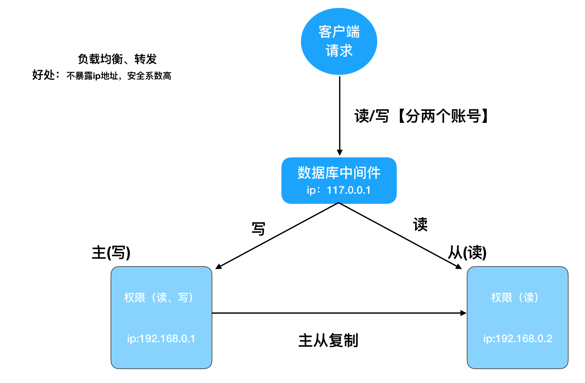

# 前言：


### 提及到的知识点：

- 高可用：容错，服务器宕机后怎么解决
- 主从复制（主、备）
- 读写分离


# 一、主从复制

### 1.1 主从复制概念

- 主（master）：核心数据访问，读、写。
- 备（slave）：主挂了，从备中选出一个做为主。

> **mysql服务器集群：**一主一备、一主多备、多主多备【备机选主机需要MyCat】



> 图中描述中从复制的应用场景，读写分离mysql原生做不到。

### 1.2 主从复制原理




### 1.3 主从复制的配置


#### 1.3.1 服务器准备

- 主：`172.17.0.2`
- 从：`172.17.0.3`


#### 1.3.2 修改主(master)服务器

```shell
vi /etc/my.cnf  # 新增以下内容

server_id=177  ###服务器id
log-bin=mysql-bin   ###开启日志文件
```


#### 1.3.3 给从服务器配置账号

```sql
GRANT REPLICATION SLAVE ON *.* to 'mysync'@'%' identified by 'q123456';

-- 一般不用root帐号，'%' 表示所有客户端都可能连，只要帐号，密码正确，此处可用具体客户端IP代替，如172.17.0.3，加强安全。
```


#### 1.3.4 查看主服务器的master状态

```sql
show master status;
```

**拿到File：**`mysql-bin.000001`，如果是`null`说明`my.cnf`没有配置好。

**拿到position：**431


#### 1.3.5 修改从(slave)服务器

**修改配置文件：**

```shell
server_id=1703
log-bin=mysql-bin
binlog_do_db=test # 注意多个的话，配置如下
# binlog_do_db=test2
```

**执行语句：**

```sql
-- 先停止主从复制
stop slave;

-- 配置
change master to master_host='172.17.0.2',master_user='mysync',master_password='q123456',
         master_log_file='mysql-bin.000001',master_log_pos=431;
         
-- 开启主从
start slave;
```


#### 1.3.6 检查从服务器复制功能状态

```sql
show slave status;
```

- `Slave_IO_Running：Yes`
- `Slave_SQL_Running：Yes`      两个状态为`yes`即成功


# 二、读写分离

&emsp;&emsp;mysql原生是没有读写分离的，需要中间件去实现读写分离。




### 2.1 MyCat的使用


#### 2.1.1 MyCat的安装

&emsp;&emsp;在mac下官网下载后解压即可，进入`bin`:【**mycat默认端口：8066**】

```shell
./mycat start
```


#### 2.1.2 相关配置

**配置server.xml：**

```xml
<!-- 添加user -->
<user name="mycat">
  <property name="password">mycat</property>
  <property name="schemas">mycat</property>
</user>

<!-- 添加user -->
<user name="mycat_red"><!-- name：账号 -->
  <property name="password">mycat_red</property><!-- 密码 -->
  <property name="schemas">mycat</property>
  <property name="readOnly">true</property><!-- 只读 -->
</user>
```

**配置schema.xml：**

```xml
<?xml version="1.0"?>
<!DOCTYPE mycat:schema SYSTEM "schema.dtd">
<mycat:schema xmlns:mycat="http://org.opencloudb/">
  <!-- 与server.xml中user的schemas名一致 -->
  <schema name="mycat" checkSQLschema="true" sqlMaxLimit="100">
    <table name="t_users" primaryKey="user_id" dataNode="dn1" rule="rule1"/><!-- 同步的表 -->
    <table name="t_message" type="global" primaryKey="messages_id" dataNode="dn1" /><!-- 同步的表 -->
  </schema>
  <!-- 配置数据原数据库 -->
  <dataNode name="dn1" dataHost="jdbchost" database="weibo_simple" />


  <dataHost name="jdbchost" maxCon="1000" minCon="10" balance="1"
            writeType="0" dbType="mysql" dbDriver="native" switchType="1"
            slaveThreshold="100">
    <heartbeat>select user()</heartbeat>  
    <!-- 配置主数据库 -->
    <writeHost host="hostMaster" url="127.0.0.1:33060" user="root" password="123456">
    </writeHost>
    <!-- 配置从数据库 -->
    <writeHost host="hostSlave" url="127.0.0.1:33061" user="root" password="123456"/>
  </dataHost>

</mycat:schema>
```

**配置rule.xml：**

```xml
<?xml version="1.0" encoding="UTF-8"?>
<!-- - - Licensed under the Apache License, Version 2.0 (the "License"); 
	- you may not use this file except in compliance with the License. - You 
	may obtain a copy of the License at - - http://www.apache.org/licenses/LICENSE-2.0 
	- - Unless required by applicable law or agreed to in writing, software - 
	distributed under the License is distributed on an "AS IS" BASIS, - WITHOUT 
	WARRANTIES OR CONDITIONS OF ANY KIND, either express or implied. - See the 
	License for the specific language governing permissions and - limitations 
	under the License. -->
<!DOCTYPE mycat:rule SYSTEM "rule.dtd">
<mycat:rule xmlns:mycat="http://org.opencloudb/">
	 <tableRule name="rule1">
        <rule>
            <columns>user_id</columns>
            <algorithm>func1</algorithm>
        </rule>
    </tableRule>
    <function name="func1" class="org.opencloudb.route.function.AutoPartitionByLong">
  		<property name="mapFile">autopartition-long.txt</property>
    </function>
</mycat:rule>
```

**配置log4j.xml:**

```xml
<level value="debug" /><!-- 将info改为debug -->
```

> **注意：**
>
> - 默认配置中存在一个分片问题，可百度解决
> - `http://org.opencloudb/`需要全部更改成`io.mycat/`

